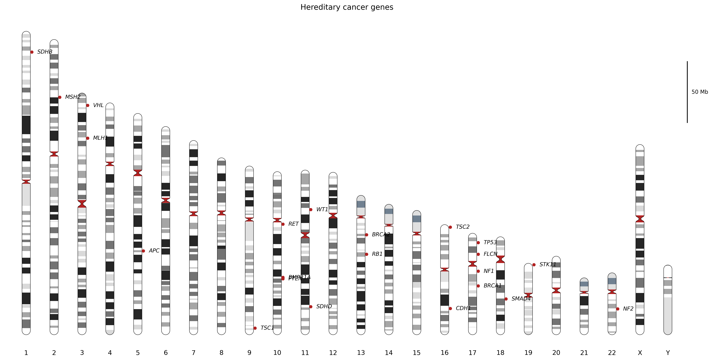
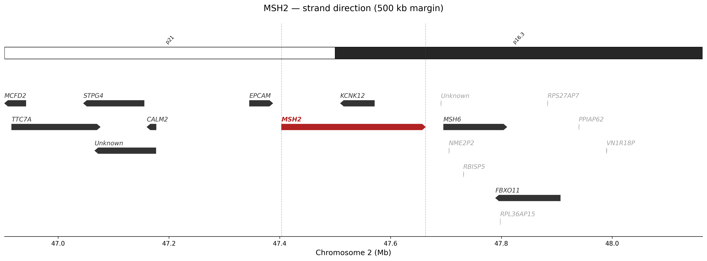
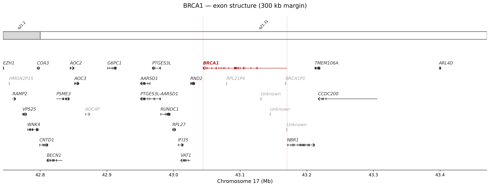
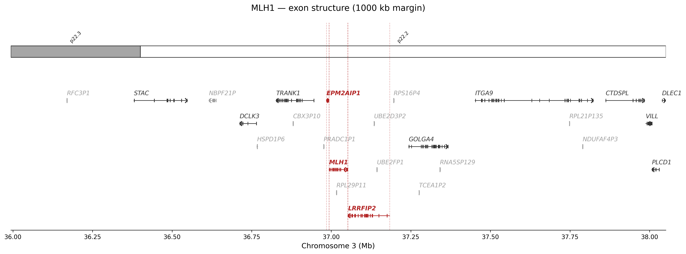

# ideoplot 🧬

Human genome ideoplot and local gene-region visualisation toolkit.

Built on top of the [Ensembl REST API](https://rest.ensembl.org) and
[UCSC cytoband data](https://hgdownload.soe.ucsc.edu), with automatic
disk-based caching so network calls are only made once.

---

## Installation

```bash
pip install ideoplot
# or for uv:
uv add ideoplot
```

**Dependencies:** `matplotlib`, `pandas`, `requests`, `numpy`

---

## Quick start

### 1 — Genome-wide ideoplot with gene markers

```python
from ideoplot import IdeoplotPlotter

plotter = IdeoplotPlotter(theme="classic")
plotter.plot(
    genes=["BRCA1", "BRCA2", "TP53", "MLH1", "MSH2", "APC"],
    scale_bar_mb=50,
    title="Hereditary cancer genes",
    save="cancer_genes.png",
)
```



### 2 — Local region view (arrow gene bodies)

```python
from ideoplot import GenomeViewer

viewer = GenomeViewer()
viewer.plot_region(
    "MSH2",
    margin_bp=500_000,
    show_exons=False,   # arrow shapes, faster
    save="msh2_arrows.png",
)
```



### 3 — Local region view with exon/intron structure

```python
viewer.plot_region(
    "BRCA1",
    margin_bp=300_000,
    show_exons=True,    # fetches exon coordinates from Ensembl
    save="brca1_exons.png",
)
```



### 4 — Highlight multiple genes in one region

```python
viewer.plot_multiple_genes(
    target_gene="MLH1",
    highlight_genes=["EPM2AIP1", "LRRFIP2"],
    margin_bp=1_000_000,
    show_exons=True,
    save="mlh1_region.png",
)
```



### 5 — Dark theme

```python
plotter = IdeoplotPlotter(theme="dark", figsize=(20, 10))
viewer  = GenomeViewer(theme="dark")
```

Available themes: `classic`, `dark`, `colorblind`, `pastel`

### 6 — Custom colour theme

```python
from ideoplot import ColorTheme, IdeoplotPlotter

my_theme = ColorTheme(
    target_gene="#FF4500",
    gene_default="#2E86AB",
    pseudogene="#CCCCCC",
)
plotter = IdeoplotPlotter(theme=my_theme)
```

### 7 — Access pre-fetched data

```python
from ideoplot.fetch import EnsemblClient, CytobandFetcher, fetch_gene_dataframe

client = EnsemblClient(cache=True)
info = client.lookup_gene("TP53")
print(info["seq_region_name"], info["start"], info["end"])

# Batch lookup
gene_df = fetch_gene_dataframe(["BRCA1", "BRCA2", "PALB2"], client=client)
print(gene_df)

# Cytoband data
bands = CytobandFetcher(assembly="hg38")
df = bands.load()          # full DataFrame
region = bands.for_region("chr13", 32_000_000, 34_000_000)
```

---

## Directory structure

```text
.
├── README.md
├── pyproject.toml
├── ideoplot/
│   ├── __init__.py
│   ├── __main__.py
│   ├── cli.py
│   ├── config.py
│   ├── core.py
│   ├── fetch.py
│   └── utils.py
├── tests/
|   └── test_basic.py
├── png/
|   ├── cancer_genes.png
|   ├── brca1_exons.png
|   ├── mlh1_region.png
|   └── msh2_arrows.png

```

---

## Command-line interface

After installation the `ideoplot` command is available:

```bash
# Genome-wide ideoplot
ideoplot genome --genes BRCA1 BRCA2 TP53 --theme colorblind --save out.png

# Multi-row genome ideoplot with XX karyotype
ideoplot genome --genes BRCA1 BRCA2 --rows 2 --karyotype XX --save karyotype.png

# Specific chromosomes only
ideoplot genome --chromosomes 1 2 X --save selected_chroms.png

# Local region with exon structure
ideoplot region --gene MSH2 --margin 500000 --exons --save msh2.svg

# List themes
ideoplot themes
```

Run `ideoplot genome --help` or `ideoplot region --help` for all options.

---

## API reference

### `IdeoplotPlotter`

| Parameter | Default | Description |
|-----------|---------|-------------|
| `assembly` | `"hg38"` | `"hg38"` or `"hg19"` |
| `theme` | `"classic"` | Theme name or `ColorTheme` object |
| `chromosomes` | all (chr1–22, X, Y) | Which chromosomes to display |
| `figsize` | `(18, 9)` | Figure size in inches |
| `chrom_width` | `0.3` | Width of chromosome bar |
| `font_size` | `10` | Label font size |
| `cache` | `True` | Disk-cache network responses |

**`.plot()` key arguments:**

| Argument | Description |
|----------|-------------|
| `genes` | List of gene symbols to mark |
| `gene_df` | Pre-computed DataFrame (overrides `genes`) |
| `marker_color` | Dot colour |
| `scale_bar_mb` | Scale bar length in Mb; `0` to hide |
| `save` | Output path (`.png`, `.svg`, `.pdf` …) |

### `GenomeViewer`

| Parameter | Default | Description |
|-----------|---------|-------------|
| `assembly` | `"hg38"` | Genome assembly |
| `theme` | `"classic"` | Theme name or `ColorTheme` |
| `figsize_width` | `16` | Figure width in inches |
| `gene_height` | `0.25` | Gene body height |
| `font_size` | `10` | Label font size |
| `include_pseudogenes` | `True` | Draw pseudogenes |
| `cache` | `True` | Disk-cache responses |

**`.plot_region()` key arguments:**

| Argument | Default | Description |
|----------|---------|-------------|
| `target_gene` | — | Gene to centre the view on |
| `margin_bp` | `500_000` | Flanking bases on each side |
| `show_exons` | `True` | Draw exon/intron structure |
| `highlight_genes` | `None` | Extra genes to highlight |
| `save` | `None` | Output path |

---

## Caching

All network responses (Ensembl lookups and UCSC cytoband data) are
cached to `~/.cache/ideoplot/` by default.  Pass `cache=False` to
disable.  Call `EnsemblClient.clear_memory_cache()` to reset the
in-process cache without touching disk files.

---

## License

MIT
